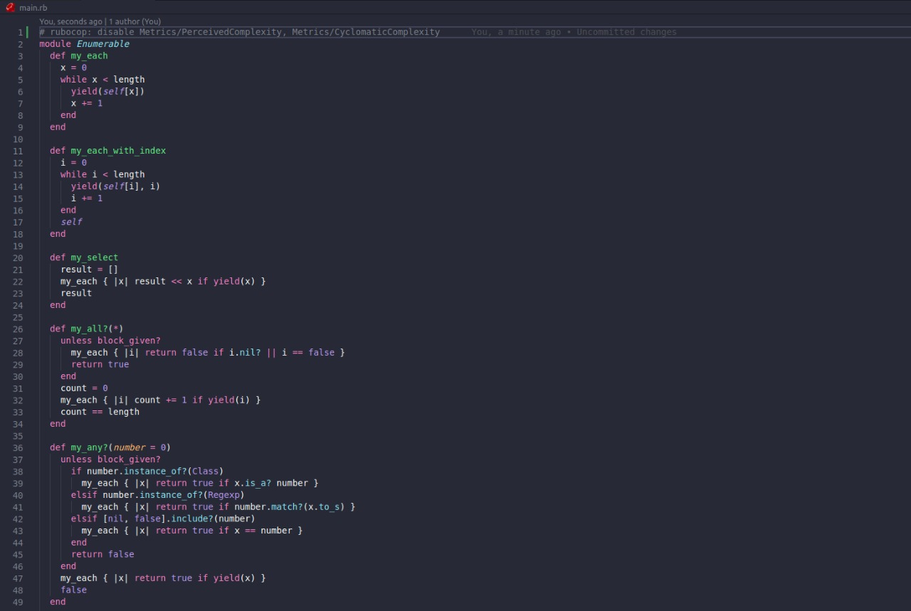

# Enumerable Methods


> Implementation of enumerable methods [here](https://github.com/TheOdinProject/curriculum/blob/master/archive/old_lessons/ruby/basic_ruby/project_advanced_building_blocks.md#project-2-enumerable-methods) by the Odin Project.


In this project, we implemented our version of Ruby’s enumerable methods. The methods that we created are:
- each
- each_with_index
- select
- all?
- none?
- count
- map
- inject

## Built With

- Ruby

### Setup

To run this project locally, please ensure you have Ruby installed on your machine, then clone this repository by running.

```bash
git clone https://github.com/mricanho/enumerables.git
```

After cloning open the file and write in terminal :

```bash 
 ruby main.rb
```
The code:




👤 **Miguel Ricaño*

- Github: [@mricanho](https://github.com/mricanho)
- Linkedin: [Miguel Ricaño](https://www.linkedin.com/in/mricanho/)

👤 **Ahmed Amin*

- Github: [@AhmedAmin90](https://github.com/AhmedAmin90)
- Twitter: [@AhmedAmin12383](https://twitter.com/AhmedAmin12383)
- LinkedIn: [in/web-developer](https://www.linkedin.com/in/web-developer)

## Show your support

Give a ⭐️ if you like this project!

## Acknowledgments

- Microverse
- The Odin Project

## 📝 License

This project is [MIT](LICENSE.md) licensed.
